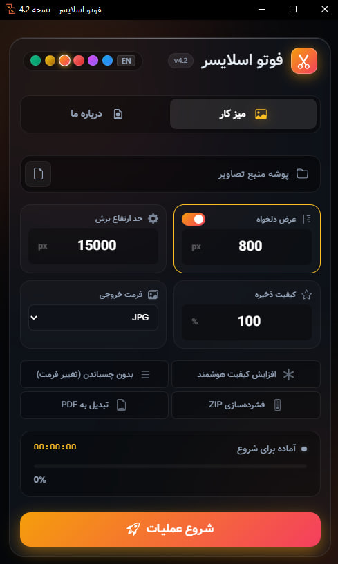

<div dir="rtl">

[🇬🇧 **Read in English**](README.md)
# 📸 PhotoSlicer v4.2
### ابزار نهایی و حرفه‌ای برای ادیتورهای مانهوا و وبتون

[](https://github.com/esmail-mkh/PhotoSlicer/releases/latest)
[](https://github.com/esmail-mkh/PhotoSlicer/releases/latest)
[](https://github.com/esmail-mkh/PhotoSlicer)


<p align="right">
  
</p>

**فوتو اسلایسر (PhotoSlicer)** یک نرم‌افزار فوق‌سریع، زیبا و پر از امکانات است که مخصوص **مترجمین و ادیتورهای وبتون، مانگا و مانهوا** طراحی شده است. این برنامه فرآیند خسته‌کننده چسباندن تصاویر، تغییر سایز، افزایش کیفیت با هوش مصنوعی و برش مجدد آن‌ها را به صورت کاملاً خودکار انجام می‌دهد.

---

## ✨ ویژگی‌های کلیدی

### 🚀 قدرت پردازش
*   **چسباندن هوشمند (Stitching):** تصاویر خام را به صورت عمودی و بدون درز به هم می‌چسباند.
*   **برش محتوا-محور (Smart Slicing):** با استفاده از الگوریتم‌های پردازش تصویر، نقاط امن (فضاهای سفید) را پیدا می‌کند تا **دیالوگ‌ها و پنل‌های نقاشی هرگز نصف نشوند.**
*   **ارتقاء کیفیت AI:** پشتیبانی داخلی از **Real-ESRGAN** برای بالا بردن کیفیت و شفاف‌سازی تصاویر قبل از پردازش.
*   **پشتیبانی از فرمت‌های متنوع:** ورودی‌های **JPG, PNG, WEBP, AVIF** و حتی فایل‌های لایه باز **PSD**.
*   **دو زبانه و دارای زبان های فارسی و انگلیسی**
*   **حالت‌های پردازش:**
    *   **حالت تکی (Single):** پردازش یک فصل خاص.
    *   **حالت گروهی (Batch):** انتخاب پوشه اصلی و پردازش ده‌ها چپتر به صورت همزمان و خودکار.

### 🎨 رابط کاربری مدرن (UI)
*   **طراحی نئونی:** رابط کاربری شیشه‌ای (Glassmorphism) با پس‌زمینه متحرک و جذاب.
*   **۶ تم رنگی:** تغییر آنی تم برنامه (آبی سایبری، بنفش الکتریک، قرمز یاقوتی، نارنجی غروب، طلایی لوکس و سبز زمردی).
*   **تعاملی:** لوگوی متحرک، ترنزیشن‌های نرم و اعلان صوتی پس از پایان کار.
*   **کنترل کامل:** قابلیت **توقف (Pause)** و **ادامه (Resume)** عملیات در هنگام پردازش‌های طولانی.

### 🛠️ ابزارهای حرفه‌ای
*   **تغییر سایز دقیق:** ریسایز کردن تصاویر با متد Bicubic برای حفظ کیفیت (مثلاً عرض استاندارد ۸۰۰ پیکسل).
*   **خروجی‌های متنوع:**
    *   ذخیره به صورت **JPG, PNG, WEBP**.
    *   فشرده‌سازی خودکار در فایل **ZIP**.
    *   ساخت فایل **PDF** یکپارچه برای مطالعه آسان.
*   **عملکرد:** استفاده از معماری چند رشته ای برای سرعت بالا در برش و تغییر سایز.

---

## 📥 راهنمای نصب

1.  **دریافت مخزن:**
    ```bash
    git clone https://github.com/esmail-mkh/PhotoSlicer.git
    cd PhotoSlicer
    ```

2.  **نصب پیش‌نیازها:**
    مطمئن شوید پایتون 3.8 یا بالاتر نصب است.
    ```bash
    pip install -r requirements.txt
    ```
    
3.  **اجرای برنامه:**
    ```bash
    python main.py
    ```

---

## 🎮 نحوه استفاده

1.  **انتخاب منبع:** روی آیکون پوشه کلیک کنید و دایرکتوری خود را انتخاب کنید.
    *   *اگر پوشه حاوی عکس باشد:* حالت Single فعال می‌شود.
    *   *اگر پوشه حاوی زیرپوشه باشد:* حالت Multi فعال می‌شود.
2.  **تنظیمات:**
    *   **Width:** عرض نهایی تصاویر (پیش‌فرض ۸۰۰).
    *   **Height Limit:** حداکثر ارتفاع هر اسلایس (پیش‌فرض ۱۵۰۰۰).
    *   **Quality:** کیفیت ذخیره‌سازی (۱ تا ۱۰۰).
    *   **Format:** فرمت خروجی را انتخاب کنید.
3.  **گزینه‌های پیشرفته:**
    *   تیک **AI Enhance** را برای افزایش کیفیت بزنید.
    *   تیک **ZIP** یا **PDF** را برای بسته‌بندی خروجی فعال کنید.
4.  **شروع:** دکمه **راکت (INITIATE)** را بزنید.
    *   در صورت نیاز می‌توانید عملیات را **Pause** کنید.
    *   پس از پایان کار، صدای اعلان پخش خواهد شد.

---

## 🖼️ تم‌ها

ظاهر برنامه را با سلیقه خود هماهنگ کنید:

| تم | توضیحات |
| :--- | :--- |
| 🔵 **Blue** | تم پیش‌فرض و سایبری |
| 🟣 **Purple** | تم ویپورویو (Vaporwave) |
| 🔴 **Ruby** | جسورانه و قدرتمند |
| 🟠 **Sunset** | گرم و صمیمی |
| 🟡 **Gold** | حس لوکس بودن |
| 🟢 **Emerald** | استایل ماتریکسی |

---

## 🧩 تکنولوژی‌های استفاده شده

*   **Backend:** Python (Pillow, NumPy, ThreadPoolExecutor)
*   **GUI:** PyWebView (موتور کرومیوم اج)
*   **Frontend:** HTML5, CSS3 (طراحی شیشه‌ای), Vanilla JavaScript
*   **AI Engine:** Real-ESRGAN (NCNN Vulkan)

---

## ☕ حمایت از من

اگر این ابزار برای شما مفید بود، می‌توانید با یک قهوه از من حمایت کنید!

<a href="https://daramet.com/esmailmkh"></a>
<a href="https://coffeebede.com/esmailmkh"></a>

---

## 🤝 مشارکت

خوشحال می‌شویم در توسعه این پروژه مشارکت کنید! Pull ریکوئست‌های شما پذیرفته می‌شود.
ساخته شده با ❤️ توسط **E.MKH**.

</div>
