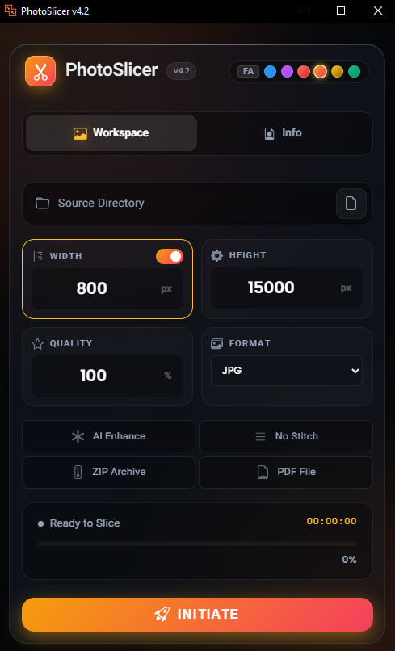

[🇮🇷 **Read in Persian (فارسی)**](README-fa.md)
# 📸 PhotoSlicer v5.1
### The Ultimate Manhwa & Webtoon Processing Tool

[](https://github.com/esmail-mkh/PhotoSlicer/releases/latest)
[](https://github.com/esmail-mkh/PhotoSlicer/releases/latest)
[](https://github.com/esmail-mkh/PhotoSlicer)


<p align="left">
  
</p>

**PhotoSlicer** is a blazing-fast, aesthetically stunning, and feature-rich application designed specifically for **Webtoon, Manhwa, and Manga translators/editors**. It automates the tedious process of stitching images together, resizing them, improving quality via AI, intelligently slicing them back into web-friendly chunks without cutting through dialogue bubbles, and adding **smart watermarks** with content-aware bubble avoidance.

---

## ✨ Key Features

### 🚀 Core Capabilities
*   **Smart Stitching:** Seamlessly merges multiple image files into long strips.
*   **Content-Aware Slicing:** Uses an intelligent algorithm (`Comparison Detector`) to find safe cutting points (whitespaces/gaps), ensuring text bubbles and artwork are never split in half.
*   **AI Enhancement:** Integrated support for **Real-ESRGAN** to upscale and denoise low-quality images before processing.
*   **Format Mastery:** Supports input from **JPG, PNG, WEBP, AVIF,** and even **PSD** files.
*   **Multi-language English and Farsi**
*   **Multi-Mode Processing:**
    *   **Single Mode:** Process one chapter/folder instantly.
    *   **Batch Mode:** Point to a root directory and process dozens of chapters automatically.

### 🖼️ Smart Watermarking System
*   **Layout-Aware Placement:** Automatically detects panel borders and gutters to place watermarks intelligently.
*   **Bubble Avoidance:** Uses advanced algorithms to detect speech bubbles and ensure watermarks never overlap with dialogue.
*   **Custom Watermark Support:** Add your own PNG watermark with configurable opacity, size, and positioning.
*   **Progress Tracking:** Dedicated progress step for watermark operations with real-time feedback.
*   **Native PNG Dimensions:** Uses original PNG resolution for crisp, high-quality watermark rendering.

### 🎨 Stunning UI & UX
*   **Neon Aurora Design:** A modern, glassmorphism-based interface with animated backgrounds.
*   **6 Color Themes:** Switch between Cyber Blue, Electric Purple, Ruby Red, Sunset Orange, Luxury Gold, and Neo Emerald instantly.
*   **Custom Theme Editor:** Create your own theme with the built-in color picker featuring a color wheel, live preview, saturation slider, and 10x10 color grid.
*   **Adaptive Contrast:** Foreground colors automatically adjust based on theme brightness for optimal readability.
*   **Settings Tab:** Configurable save location, presets, and advanced options in a dedicated settings panel.
*   **Drag & Drop Support:** Drag and drop folders directly onto the app with an animated drop zone.
*   **Advanced Filename Patterning:** Custom filename templates with visual guide for organized output.
*   **Interactive Elements:** Animated logos, glassmorphism tabs with sliding pill indicator, smooth transitions, and sound alerts upon completion.
*   **Control Center:** Pause and Resume large batch operations at any time.

### 🛠️ Power User Tools
*   **Custom Resizing:** High-quality Bicubic resizing to your target width (e.g., 800px standard).
*   **Export Options:**
    *   Save as **JPG, PNG, WEBP, PSD or CBZ**.
    *   Custom layered **PSD** export with editable watermark layers.
    *   Auto-archive into **ZIP** files.
    *   Generate long-strip **PDFs** for easy reading.
*   **Presets:** Save and load entire configurations (format, quality, width, etc.) for quick reuse.
*   **Performance:** Multi-threaded architecture for lightning-fast resizing, slicing, and watermarking.

---

## 📥 Installation

1.  **Clone the Repository:**
    ```bash
    git clone https://github.com/esmail-mkh/PhotoSlicer.git
    cd PhotoSlicer
    ```

2.  **Install Dependencies:**
    Ensure you have Python 3.8+ installed.
    ```bash
    pip install -r requirements.txt
    ```
    *Required libs based on code: `pywebview`, `Pillow`, `pillow-heif`, `psd-tools`, `numpy`.*

3.  **Run the App:**
    ```bash
    python main.py
    ```

---

## 🎮 How to Use

1.  **Select Source:** Click the folder icon to choose your directory.
    *   *If the folder contains images:* Single Mode is activated.
    *   *If the folder contains sub-folders:* Multi/Batch Mode is activated.
2.  **Configure Settings:**
    *   **Width:** Set your target width (default: 800px).
    *   **Height Limit:** Maximum height for a single slice (default: 15000px).
    *   **Quality:** JPG/WebP compression quality (1-100).
    *   **Format:** Choose your output format.
3.  **Advanced Options:**
    *   Toggle **AI Enhance** for upscaling.
    *   Check **ZIP** or **PDF** if you want packaged outputs.
4.  **Initiate:** Click the **ROCKET** button to start.
    *   You can **Pause/Resume** the process if needed.
    *   A sound will play when the job is done.

---

## 🖼️ Themes

Customize your experience with built-in themes:
| Theme | Description |
| :--- | :--- |
| 🔵 **Blue** | Default Cyberpunk look |
| 🟣 **Purple** | Vaporwave aesthetic |
| 🔴 **Ruby** | Aggressive & Bold |
| 🟠 **Sunset** | Warm & Cozy |
| 🟡 **Gold** | Premium feel |
| 🟢 **Emerald** | Matrix vibes |

---

## 🧩 Tech Stack

*   **Backend:** Python (Pillow, NumPy, ThreadPoolExecutor)
*   **GUI:** PyWebView (Edge Chromium engine)
*   **Frontend:** HTML5, CSS3 (Glassmorphism), Vanilla JavaScript
*   **AI Engine:** Real-ESRGAN (NCNN Vulkan)

---

## ☕ Support Me

If you find this tool useful, you can support development by buying me a coffee!

<a href="https://daramet.com/esmailmkh"></a>
<a href="https://coffeebede.com/esmailmkh"></a>

---

## 🤝 Contributing

Contributions are welcome! Feel free to submit a Pull Request.
Created with ❤️ by **E.MKH**.
